# Agentic Threat Intelligence Platform

## Purpose

The **Agentic Threat Intelligence Platform** evolves the existing deterministic-first threat-triage solution from a selectively invoked single-agent architecture into a **Python-only, multi-agent security decision platform**.

The goal is not to convert every processing step into an agent. Classical ML, deterministic security controls, policy enforcement, schema validation, authorization, and security-critical decision boundaries remain deterministic where predictability and reproducibility are more important than generative reasoning.

> **Deterministic evidence first. Specialized agents reason over trusted evidence. Policy remains authoritative. Human review remains first-class.**

## Platform Goals

1. Independent specialized agents with narrow responsibilities.
2. Dynamic capability discovery instead of static agent wiring.
3. Standardized typed communication contracts.
4. MCP-enabled tool and context integration.
5. Secure minimum-necessary information sharing.
6. Bidirectional request/response and event-driven communication.
7. Shared evidence without shared mutable agent internals.
8. Deterministic policy enforcement outside LLM reasoning.
9. Full observability and auditability.
10. Graceful degradation when an agent, model, or tool is unavailable.
11. Versioned contracts that allow independent evolution.
12. Model-provider abstraction so Gemini or any other model is not embedded into domain logic.

## High-Level Architecture

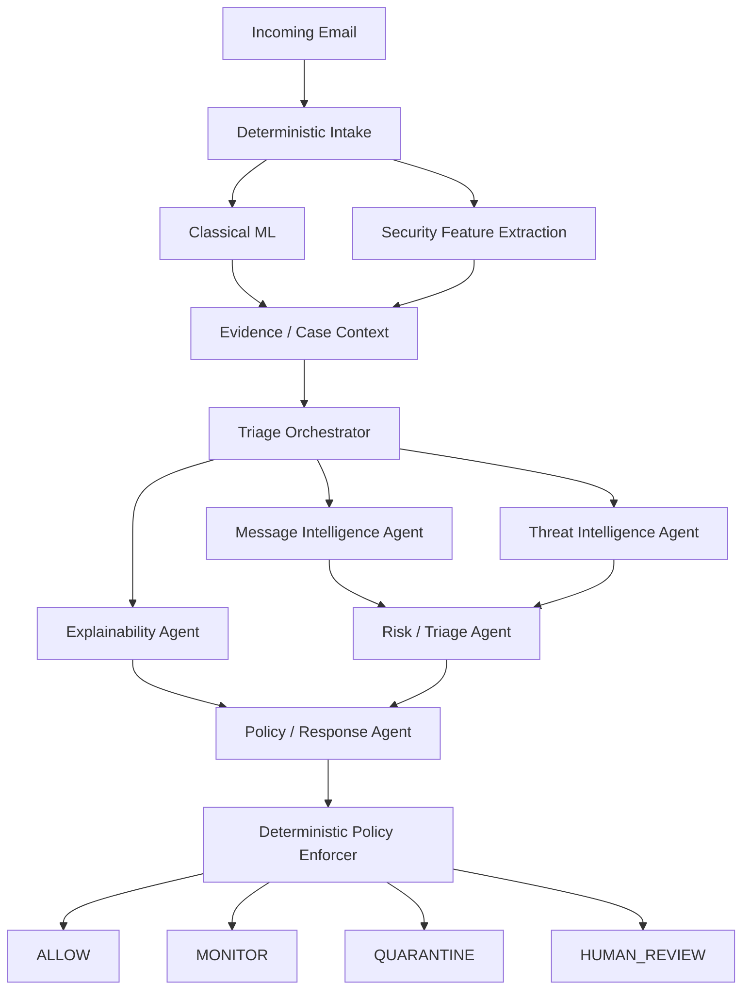

## Agent Responsibilities

### 1. Triage Orchestrator

The orchestrator owns coordination, not domain judgment.

Responsibilities:
- receives a `CaseContext`
- determines which specialist capabilities are required
- invokes specialists in parallel when safe
- applies timeout, retry, and budget policies
- aggregates specialist outputs
- detects conflicts
- forwards normalized evidence to downstream reasoning
- never overrides deterministic policy

Recommended patterns:
- **Mediator / Orchestrator**
- **Strategy** for routing
- **Circuit Breaker** around remote dependencies

### 2. Message Intelligence Agent

Responsibilities:
- semantic intent analysis
- impersonation indicators
- social-engineering cues
- urgency/coercion interpretation
- contextual inconsistency analysis
- entity extraction for downstream enrichment

Inputs:
- sanitized subject/body
- sender metadata
- deterministic language/security features

Outputs:
- structured findings
- confidence
- evidence references
- recommended follow-up capabilities

### 3. Threat Intelligence Agent

Responsibilities:
- consumes normalized indicators such as domains, URLs, IPs, and hashes
- queries approved providers through MCP tools
- correlates reputation data
- reports provenance and freshness
- avoids sending full email bodies to external reputation tools

Potential MCP-backed providers:
- VirusTotal
- URLHaus
- AbuseIPDB
- internal threat-intelligence services
- future sandbox/reputation services

### 4. Risk / Triage Agent

Responsibilities:
- synthesizes deterministic evidence and specialist findings
- identifies ambiguity and conflicting evidence
- recommends risk severity and operational disposition
- separates observed evidence from inference

Its output is advisory and must pass through deterministic policy enforcement.

### 5. Explainability Agent

Responsibilities:
- creates analyst-readable explanations
- organizes evidence by provenance
- explains why a route was selected
- produces concise executive and analyst views
- never invents evidence not present in the case

### 6. Policy / Response Agent

Responsibilities:
- proposes response options from an approved action vocabulary
- maps the case to response playbooks
- may propose `ALLOW`, `MONITOR`, `QUARANTINE`, or `HUMAN_REVIEW`
- cannot execute security-critical actions directly

## Deterministic Boundaries

The following components remain deterministic:

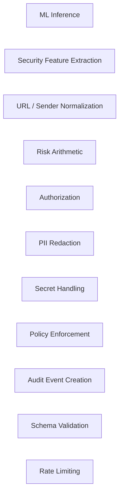

These components must remain predictable, testable, and reproducible.

## MCP Positioning

MCP is the standardized boundary between agents and capabilities.

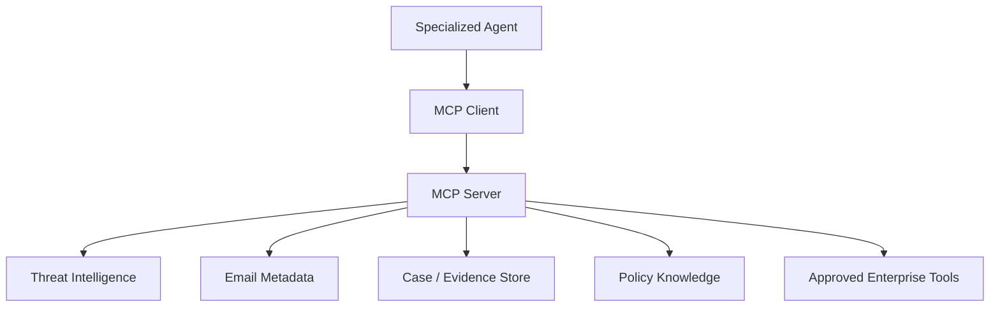

MCP is **not** the primary agent-to-agent messaging protocol. Internal agent collaboration uses typed communication contracts and the orchestration layer.

## Shared Case Model

Agents receive a scoped immutable view of the case.

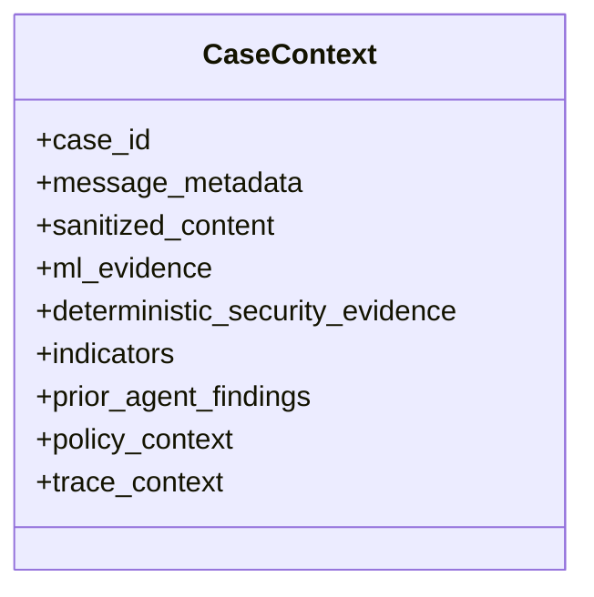

Every finding should include:
- source
- timestamp
- contract version
- confidence
- evidence references
- sensitivity classification
- provenance

## Secure Information Sharing

Security principles:
1. Minimum necessary disclosure.
2. Redact before external model/tool calls.
3. Prefer indicator sharing over full-content sharing.
4. Attach sensitivity labels.
5. Maintain provenance.
6. Use short-lived scoped credentials.
7. Never place secrets in prompts.
8. Never allow one agent to read another agent's private runtime state.
9. Separate case evidence from conversation memory.
10. Log metadata/hashes instead of raw content where possible.

Suggested classifications:

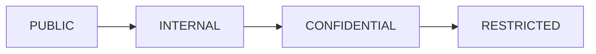

A `DisclosurePolicy` decides which fields a target agent or tool is permitted to receive.

## Standard Communication Model

All internal messages use a common envelope.

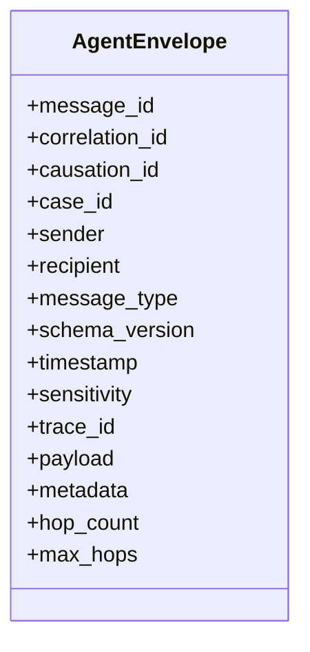

Supported message types:
- `REQUEST`
- `RESPONSE`
- `EVENT`
- `ERROR`
- `CANCEL`
- `HEARTBEAT`
- `CAPABILITY_ANNOUNCEMENT`

## Dynamic Discovery

Agents expose `AgentCapability` metadata:
- name
- version
- description
- supported tasks
- accepted contracts
- produced contracts
- required scopes
- health
- priority
- endpoint

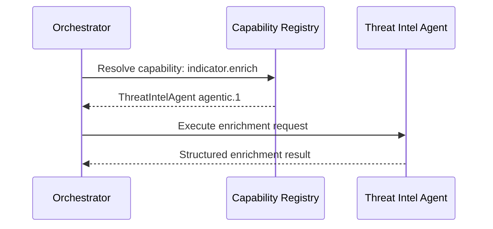

This enables:
- new agents without orchestrator rewrites
- model/provider swaps
- blue/green agent versions
- capability-based routing
- future remote agents

## Bidirectional Communication

### Synchronous request/response

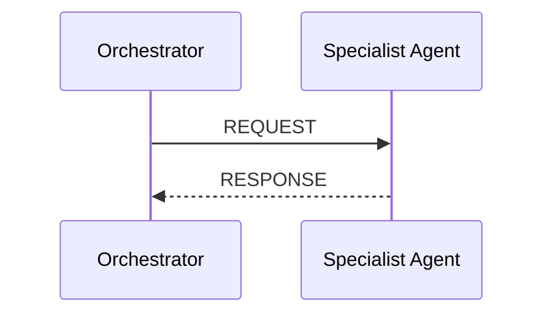

### Asynchronous progress

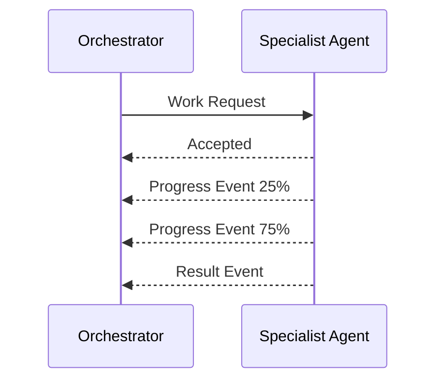

### Agent requests more context

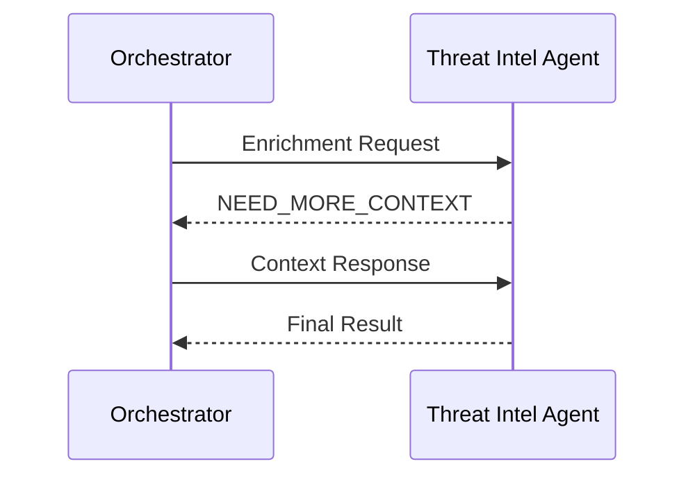

Agents should not form arbitrary peer-to-peer call graphs. Collaboration flows through the orchestrator/communication abstraction for loop control and auditability.

## Loop Prevention

Every envelope carries:
- `correlation_id`
- `causation_id`
- `hop_count`
- `max_hops`

The orchestrator also maintains:
- visited agent/task pairs
- deadline
- token/cost budget
- per-agent invocation count

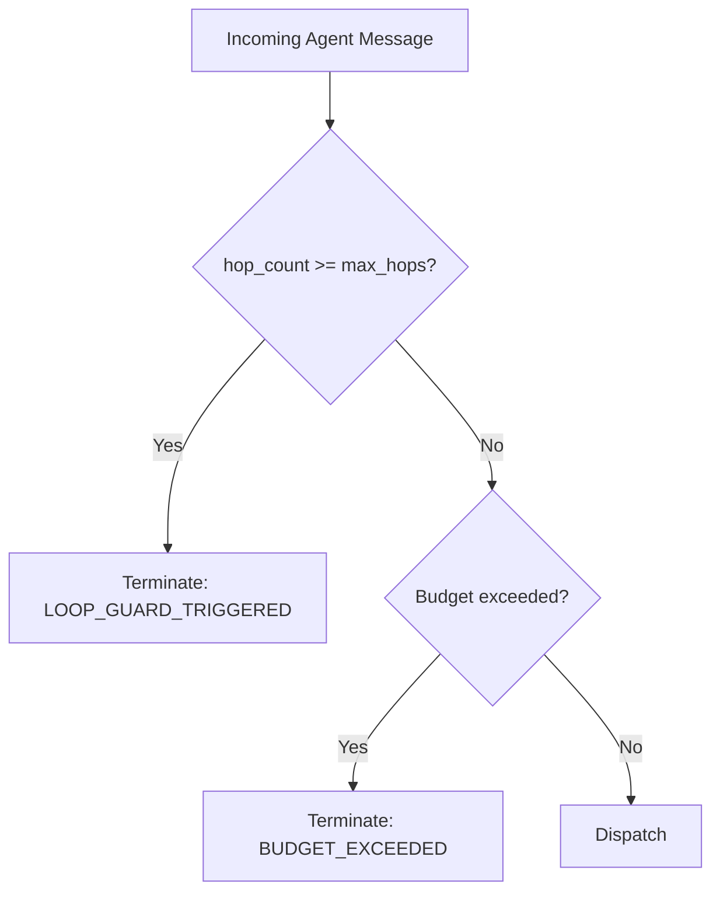

## Failure Handling

Every remote agent/tool interaction should implement:
- timeout
- bounded retry with exponential backoff
- circuit breaker
- fallback
- idempotency key
- structured error result

Failure categories:
- `AUTHENTICATION`
- `AUTHORIZATION`
- `RATE_LIMIT`
- `TIMEOUT`
- `DEPENDENCY_UNAVAILABLE`
- `INVALID_RESPONSE`
- `POLICY_DENIED`
- `CONTRACT_VIOLATION`
- `INTERNAL_ERROR`

A failed agent should not automatically fail the entire decision. The deterministic path remains available.

## Model Abstraction

Agents depend on a model protocol rather than a vendor SDK.

```python
class ReasoningModel(Protocol):
    async def complete(self, request: ModelRequest) -> ModelResponse:
        ...
```

Adapters can support:
- Gemini
- Vertex AI
- Amazon Bedrock
- OpenAI
- local models
- future providers

Provider selection is configuration, not business logic.

## Observability

Every case receives a single trace ID.

Recommended telemetry:
- case ID
- trace ID
- agent name/version
- model/provider
- tool calls
- latency
- token usage
- estimated cost
- routing decision
- policy decision
- human escalation
- errors

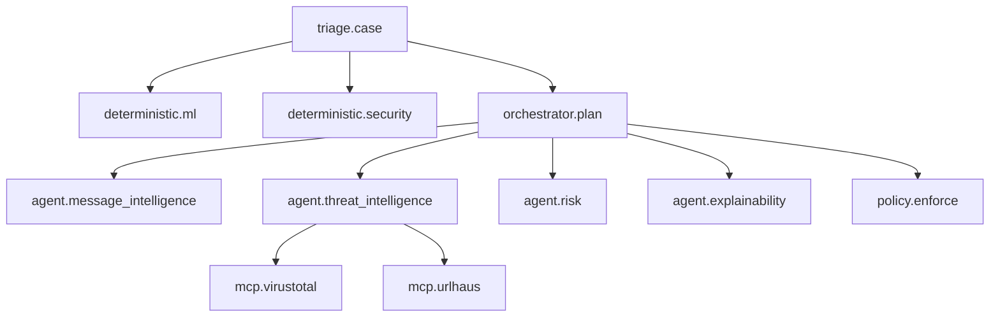

Use OpenTelemetry-compatible spans where possible.

## Audit Model

All externally meaningful decisions create immutable audit events.

An audit record includes:
- case identifier
- input hash
- decision
- evidence references
- agent/model versions
- policy version
- actor
- timestamps
- human override details

## Human-in-the-Loop

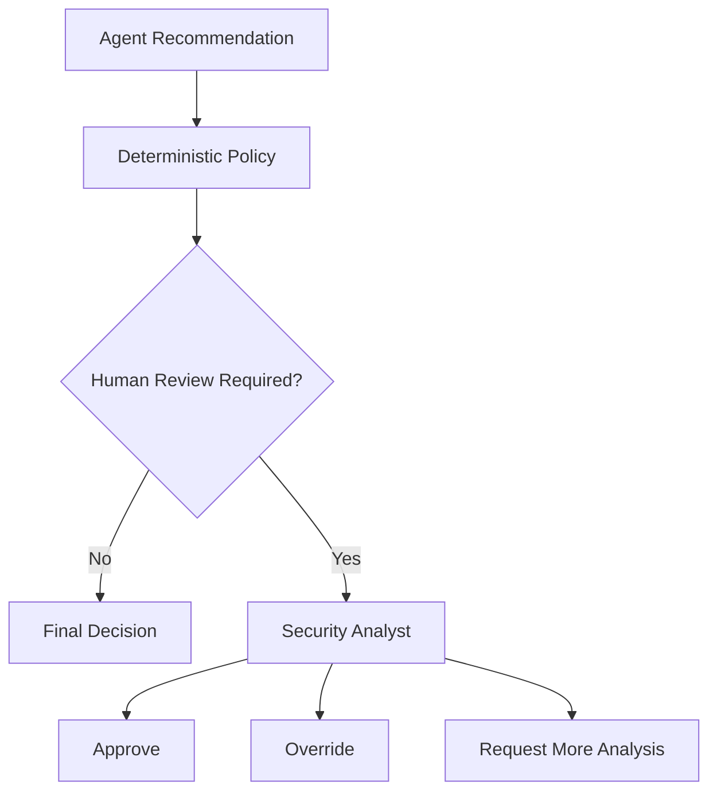

The human decision is stored separately from the agent recommendation.

## Proposed Python Package Layout


src/agentic_threat_intelligence/
├── agents/
│   ├── base.py
│   ├── orchestrator.py
│   ├── message_intelligence.py
│   ├── threat_intelligence.py
│   ├── risk_triage.py
│   ├── explainability.py
│   └── policy_response.py
├── communication/
│   ├── contracts.py
│   ├── envelope.py
│   ├── bus.py
│   ├── registry.py
│   ├── session.py
│   └── security.py
├── mcp/
│   ├── client.py
│   ├── server.py
│   └── tools/
├── models/
│   ├── reasoning.py
│   └── providers/
├── policy/
│   ├── engine.py
│   └── disclosure.py
├── evidence/
│   ├── models.py
│   └── store.py
├── observability/
│   ├── tracing.py
│   └── audit.py
└── config/


## Example Execution Flow

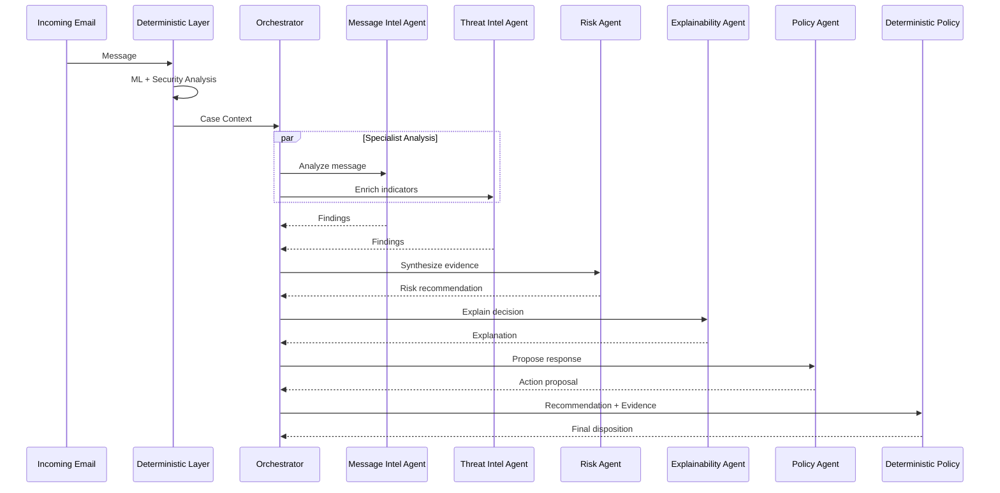

## Design Patterns

| Pattern | Purpose |
|---|---|
| Mediator | Orchestrator controls agent collaboration |
| Strategy | Routing/model/policy selection |
| Adapter | LLM, MCP, threat-intel integrations |
| Factory | Dynamic agent/provider construction |
| Registry | Capability discovery |
| Observer / Pub-Sub | Agent events and progress |
| Circuit Breaker | Dependency failure isolation |
| Command | Typed agent work requests |
| Chain of Responsibility | Evidence/policy processing |
| Repository | Evidence/audit persistence |
| Facade | Stable application-facing orchestration API |

## Security Boundaries

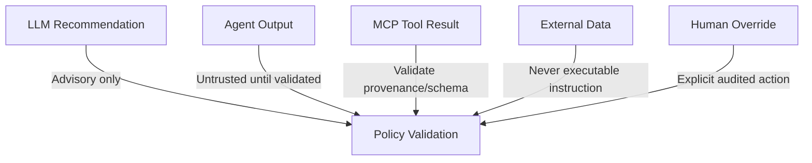

Mandatory principles:
- LLM recommendation ≠ security authorization
- agent output ≠ verified evidence
- MCP tool result ≠ trusted until validated
- external data ≠ executable instruction
- human override ≠ silent mutation

## Migration from the Current Baseline

### Foundation 1 — Communication Foundation
Introduce typed contracts, envelopes, registry, disclosure policy, tracing, and tests while keeping the current single review agent.

### Foundation 2 — Message Intelligence
Extract message interpretation into a dedicated specialist.

### Foundation 3 — Threat Intelligence + MCP
Add MCP-based threat-intelligence tooling and provider adapters.

### Foundation 4 — Risk and Explainability
Add specialized synthesis and analyst-explanation agents.

### Foundation 5 — Policy / Response
Add response recommendations under deterministic enforcement.

### Foundation 6 — Production Hardening
Add persistence, OpenTelemetry, budgets, circuit breakers, health/discovery, and performance testing.

## Non-Goals

The platform should not:
- create agents merely to increase agent count
- allow agents to call arbitrary tools
- share full messages with every specialist
- use LLMs for hard authorization
- replace deterministic threat indicators with generative guesses
- allow unbounded recursive agent conversations
- hide model/tool failures
- depend on one LLM provider at the domain layer

## Portfolio Positioning

**Current baseline**

> Deterministic-first threat triage with classical ML, security evidence, risk policy, and selective single-agent reasoning.

**Agentic Threat Intelligence Platform**

> Python multi-agent security decision platform with specialized agents, capability-based orchestration, MCP-enabled tool integration, secure evidence exchange, deterministic policy enforcement, observability, auditability, and human-in-the-loop escalation.


## GitHub Setup

Repository initialization, staged check-in commands, commit messages, remote configuration, and tagging are documented in `docs/github_setup.md`.
