# Agentic Threat Intelligence Platform

A Python-only, multi-agent cybersecurity decision platform that extends a deterministic-first threat-triage architecture with specialized agents, secure evidence exchange, MCP-enabled tool integration, deterministic policy enforcement, observability, and human-in-the-loop escalation.

> **Deterministic evidence first. Specialized agents reason over trusted evidence. Policy remains authoritative. Human review remains first-class.**

---

## 1. Purpose

The **Agentic Threat Intelligence Platform** is designed to evolve an existing threat-triage baseline from selective single-agent reasoning into a structured multi-agent security decision platform.

The platform does **not** convert every processing step into an agent. Components that require predictability, reproducibility, and security guarantees remain deterministic.

The architecture separates:

- deterministic evidence generation
- specialized agent reasoning
- MCP-based tool integration
- risk synthesis
- deterministic policy enforcement
- post-decision explanation
- human escalation
- audit and observability

---

## 2. Core Design Principles

1. **Deterministic-first security**
   - Classical ML and deterministic security analysis produce the initial trusted evidence.

2. **Specialized agents**
   - Agents have narrow responsibilities rather than acting as general-purpose autonomous components.

3. **Policy remains authoritative**
   - Agent recommendations are advisory.
   - Final operational disposition is enforced by deterministic policy.

4. **Minimum-necessary information sharing**
   - Each agent receives only the information required for its task.

5. **MCP for tools and context**
   - MCP standardizes access to tools, resources, and enterprise capabilities.
   - MCP is not used as the internal agent-to-agent messaging protocol.

6. **Typed communication**
   - Agent communication uses versioned contracts and standardized envelopes.

7. **Dynamic discovery**
   - Agents expose capabilities that can be resolved at runtime.

8. **Bounded autonomy**
   - Hop limits, invocation budgets, deadlines, retries, and policy boundaries prevent uncontrolled agent loops.

9. **Explainability after decision**
   - The Explainability Agent explains evidence and final decisions.
   - It does not authorize or influence the final security disposition.

10. **Human-in-the-loop**
    - Critical or ambiguous cases can be explicitly escalated to analysts.

---

## 3. High-Level Architecture

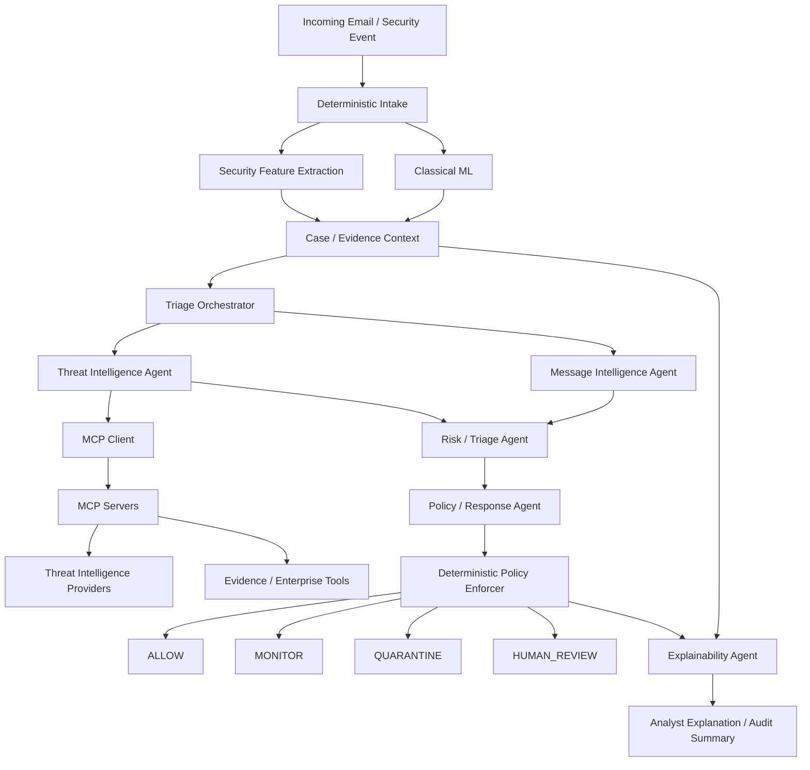

### Decision Flow

The critical decision path is:

**Deterministic Evidence → Specialized Analysis → Risk/Triage → Policy Recommendation → Deterministic Policy Enforcement → Final Disposition**

The Explainability Agent operates after evidence and final policy outcome are available.

---

## 4. Specialized Agents

### 4.1 Triage Orchestrator

The Triage Orchestrator coordinates work across specialized agents.

Responsibilities:

- receive the case context
- resolve required capabilities
- determine which agents should run
- execute independent agents concurrently when safe
- apply deadlines and invocation budgets
- apply retry and failure policies
- aggregate structured findings
- detect missing or conflicting evidence
- prevent uncontrolled recursive agent calls
- forward normalized evidence to downstream stages

The orchestrator does **not** override deterministic security policy.

Recommended patterns:

- Mediator
- Strategy
- Circuit Breaker
- Command
- Registry

---

### 4.2 Message Intelligence Agent

The Message Intelligence Agent performs semantic and contextual analysis of message content.

Responsibilities:

- identify likely intent
- detect social-engineering language
- identify urgency or coercion
- identify impersonation cues
- identify contextual inconsistencies
- extract entities useful to downstream analysis
- produce structured findings with confidence and provenance

Typical inputs:

- sanitized subject
- sanitized body
- sender metadata
- deterministic language features
- selected security signals

Typical outputs:

- findings
- confidence
- evidence references
- follow-up capability recommendations

---

### 4.3 Threat Intelligence Agent

The Threat Intelligence Agent enriches technical indicators using approved tools.

Responsibilities:

- analyze URLs
- analyze domains
- analyze IP addresses
- analyze file hashes
- query threat-intelligence providers through MCP tools
- correlate reputation findings
- preserve source provenance
- record evidence freshness
- avoid sending unnecessary message content to external services

Potential MCP-backed integrations:

- VirusTotal
- URLHaus
- AbuseIPDB
- internal reputation services
- enterprise security platforms
- future sandbox services

---

### 4.4 Risk / Triage Agent

The Risk / Triage Agent synthesizes deterministic evidence and specialist findings.

Responsibilities:

- combine trusted evidence
- identify ambiguity
- identify conflicting findings
- recommend severity
- recommend operational disposition
- distinguish evidence from inference
- provide confidence and supporting references

Its recommendation remains advisory until evaluated by deterministic policy.

---

### 4.5 Policy / Response Agent

The Policy / Response Agent proposes an operational response using an approved action vocabulary.

Possible recommendations:

- `ALLOW`
- `MONITOR`
- `QUARANTINE`
- `HUMAN_REVIEW`

Responsibilities:

- interpret risk findings
- map evidence to approved response playbooks
- propose an operational disposition
- provide rationale and evidence references

The Policy / Response Agent does **not** directly execute security-critical actions.

Its recommendation is passed to the deterministic policy layer.

---

### 4.6 Explainability Agent

The Explainability Agent produces human-readable explanations after the evidence and final policy outcome are available.

Responsibilities:

- explain important evidence
- explain the final disposition
- organize evidence by provenance
- provide analyst-friendly summaries
- provide executive-level summaries when required
- explain why Agentic AI was or was not invoked
- distinguish deterministic evidence from agent inference

The Explainability Agent must not change the final decision.

---

## 5. Deterministic Security Boundary

The following capabilities remain deterministic:

- ML inference
- security feature extraction
- URL parsing
- sender/domain normalization
- hard risk thresholds
- authorization
- PII redaction
- secret handling
- schema validation
- rate limiting
- audit-event generation
- final policy enforcement

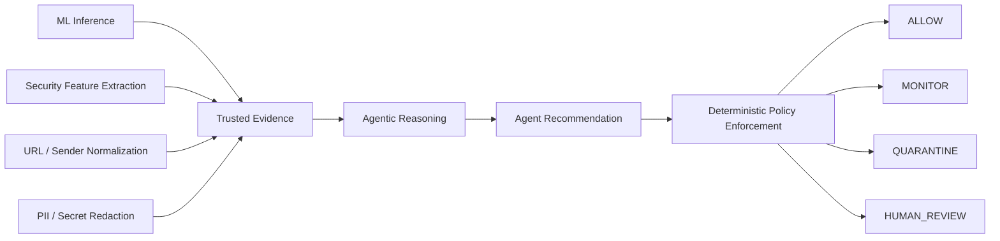

### Security Rule

> **Agent output is a recommendation, not an authorization.**

---

## 6. MCP Positioning

MCP is used as the standardized boundary between agents and tools, resources, and enterprise capabilities.

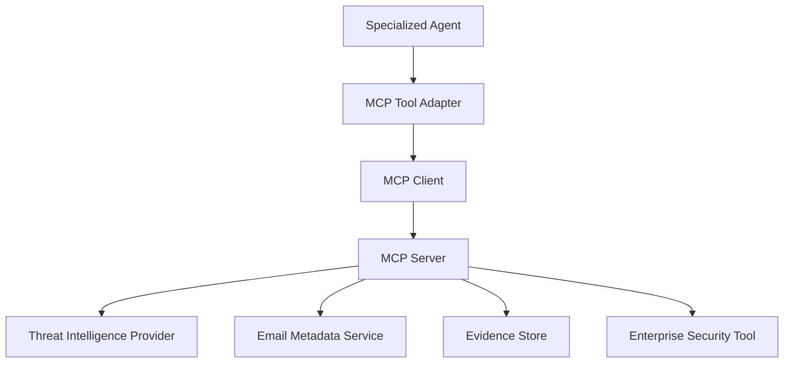

### MCP is used for

- tool discovery
- tool invocation
- resource access
- context access
- integration standardization

### MCP is not used for

- uncontrolled agent-to-agent conversations
- replacing orchestration
- final security authorization
- bypassing disclosure policy

Internal agent communication uses typed contracts and the communication framework.

---

## 7. Standard Agent Communication

Every cross-agent message uses a common envelope.

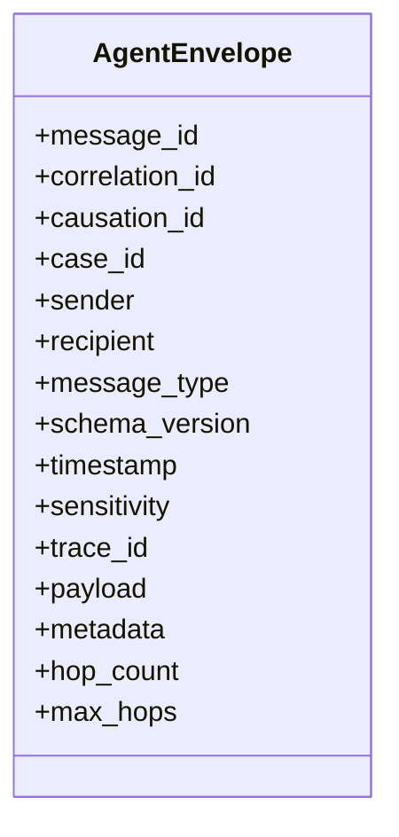

Supported message types:

- `REQUEST`
- `RESPONSE`
- `EVENT`
- `ERROR`
- `CANCEL`
- `HEARTBEAT`
- `CAPABILITY_ANNOUNCEMENT`

### Correlation and causation

`correlation_id` identifies the complete interaction.

`causation_id` identifies which prior message caused the current message.

This allows complete tracing of multi-agent workflows.

---

## 8. Secure Information Sharing

The communication framework follows minimum-necessary disclosure.

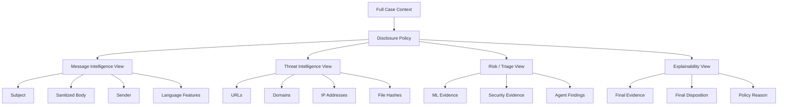

### Suggested sensitivity classifications

- `PUBLIC`
- `INTERNAL`
- `CONFIDENTIAL`
- `RESTRICTED`

### Security requirements

- secrets must never be placed in prompts
- credentials must never be placed in agent payloads
- restricted fields must be explicitly allow-listed
- full message bodies should not be sent to reputation services
- evidence provenance must be preserved
- external tool output must be validated before use
- agent private runtime state must not be exposed to other agents

---

## 9. Dynamic Capability Discovery

Agents register capabilities rather than being hard-coded into orchestration logic.

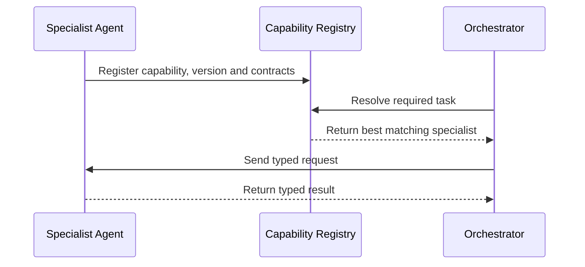

A capability can describe:

- agent name
- version
- description
- supported tasks
- accepted contracts
- produced contracts
- required scopes
- priority
- endpoint
- health status

Dynamic discovery enables:

- adding new specialists without rewriting the orchestrator
- versioned agent deployments
- blue/green agent upgrades
- provider substitution
- capability-based routing
- remote agents in future deployments

---

## 10. Bidirectional Communication

### 10.1 Request / Response

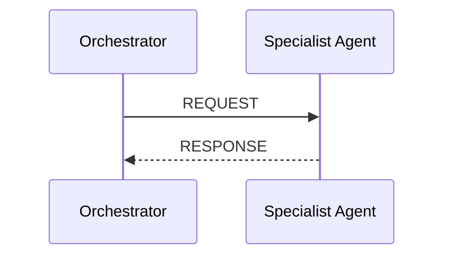

### 10.2 Progress Events

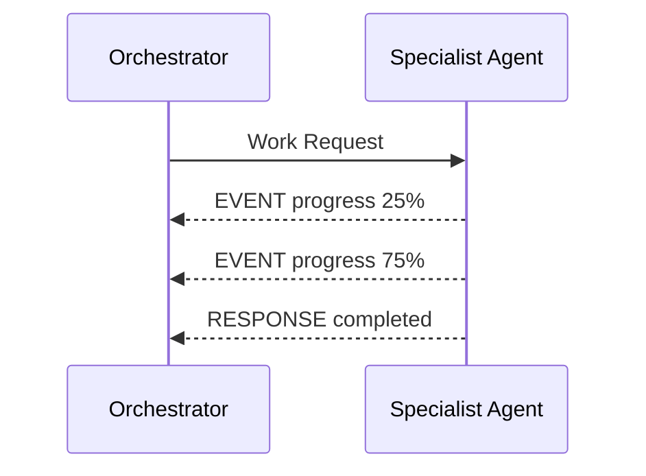

### 10.3 Agent Requests Additional Context

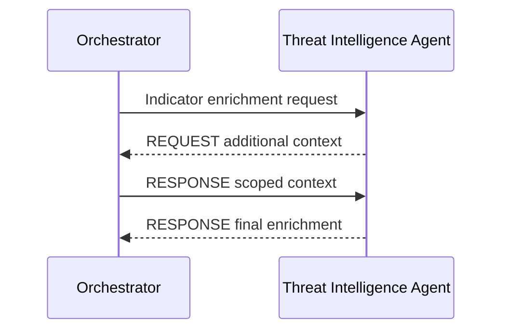

Agents should not create unrestricted peer-to-peer call graphs.

Collaboration flows through the orchestration and communication boundaries so that loops, budgets, and auditability remain controlled.

---

## 11. Loop Prevention and Budget Controls

Every agent message carries:

- `correlation_id`
- `causation_id`
- `hop_count`
- `max_hops`

The orchestrator should additionally enforce:

- case deadline
- maximum agent invocations
- per-agent invocation limits
- token budget
- cost budget
- visited `(agent, task)` pairs
- retry limits

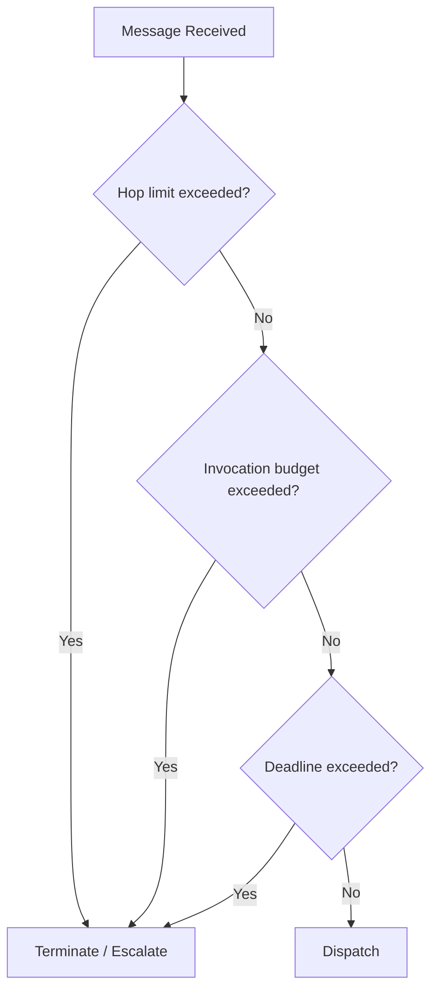

---

## 12. Failure Handling

Every remote agent, model, or tool invocation should support:

- timeout
- bounded retry
- exponential backoff
- circuit breaker
- fallback
- idempotency
- structured error reporting

Recommended error categories:

- `AUTHENTICATION`
- `AUTHORIZATION`
- `RATE_LIMIT`
- `TIMEOUT`
- `DEPENDENCY_UNAVAILABLE`
- `INVALID_RESPONSE`
- `POLICY_DENIED`
- `CONTRACT_VIOLATION`
- `INTERNAL_ERROR`

A failed agent should not automatically fail the entire security decision.

Where possible, the deterministic path should remain available.

---

## 13. Model Provider Abstraction

Agents depend on a common reasoning-model interface instead of a provider-specific SDK.

```python
class ReasoningModel(Protocol):
    async def complete(
        self,
        request: ModelRequest,
    ) -> ModelResponse:
        ...
```

Potential adapters:

- Gemini
- Vertex AI
- Amazon Bedrock
- OpenAI
- local models
- future enterprise providers

Provider selection should remain configuration rather than domain logic.

---

## 14. Observability

Every case should receive one trace ID.

Recommended telemetry:

- case ID
- trace ID
- correlation ID
- agent name
- agent version
- model provider
- model name
- tool calls
- tool latency
- model latency
- token usage
- estimated cost
- risk recommendation
- policy disposition
- human escalation
- failures

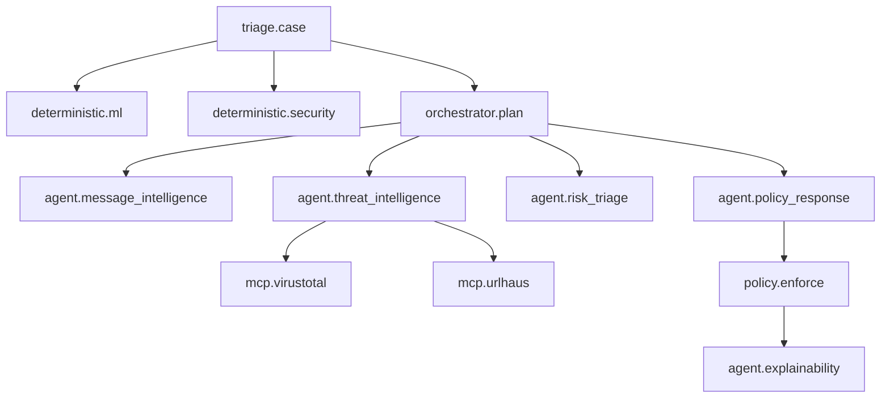

OpenTelemetry-compatible spans are recommended for production.

---

## 15. Audit Model

Every externally meaningful decision should generate an immutable audit event.

Recommended audit fields:

- case identifier
- input hash
- final disposition
- deterministic evidence references
- agent findings references
- agent versions
- model versions
- policy version
- timestamps
- actor
- human override
- override reason

Agent recommendations and human decisions should be stored independently.

---

## 16. Human-in-the-Loop

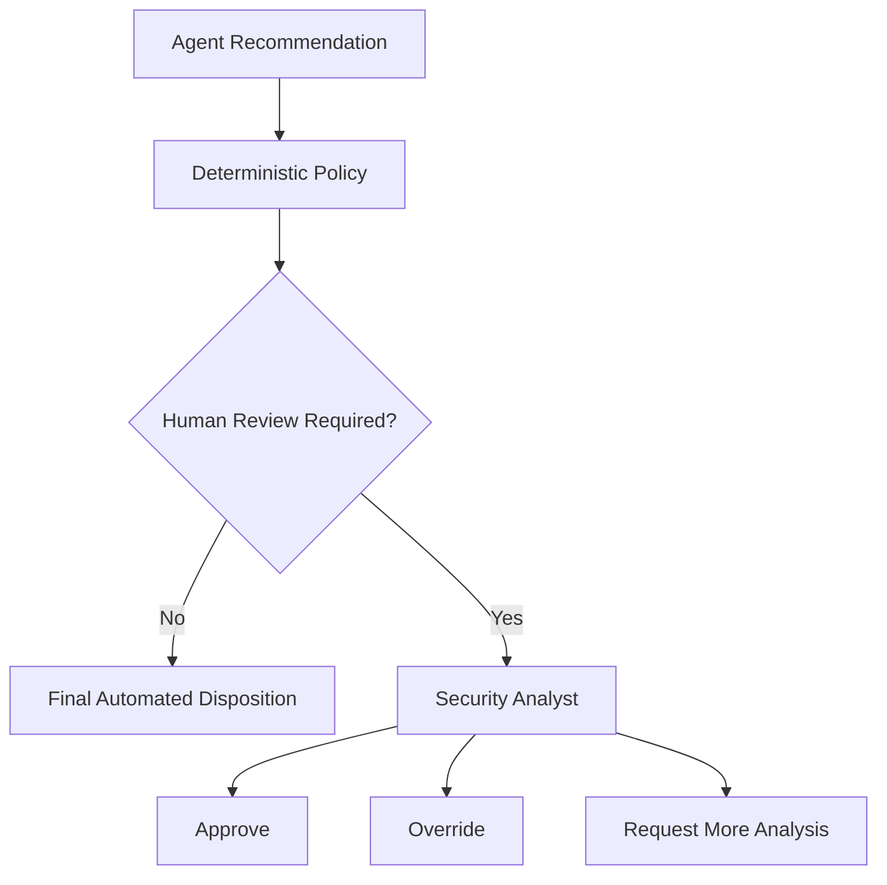

Human review is an explicit workflow state, not an exception.

---

## 17. Design Patterns

| Pattern | Purpose |
|---|---|
| Mediator | Orchestrator controls collaboration |
| Strategy | Routing, disclosure and provider selection |
| Adapter | MCP, LLM and external service integration |
| Factory | Future dynamic agent/provider construction |
| Registry | Capability discovery |
| Observer / Pub-Sub | Progress and lifecycle events |
| Circuit Breaker | Remote dependency isolation |
| Command | Typed agent work requests |
| Chain of Responsibility | Evidence and policy processing |
| Repository | Future evidence/audit persistence |
| Facade | Stable application-facing orchestration boundary |

---

## 18. Current Repository Foundation

The initial repository contains the architectural foundation rather than the complete production multi-agent implementation.

Current components include:

- typed agent envelopes
- correlation and causation tracking
- sensitivity classification
- disclosure policy
- capability registry
- lease-based dynamic discovery foundation
- in-memory communication bus
- bounded conversation state
- retry abstraction
- MCP tool adapter boundary
- provider-independent reasoning model protocol
- orchestrator foundation
- deterministic policy engine
- tests for core communication and policy behavior

Future specialist agents are added incrementally according to the roadmap.

---

## 19. Repository Structure

| Path | Responsibility |
|---|---|
| `src/agentic_threat_intelligence/agents/` | Agent abstractions and orchestration |
| `src/agentic_threat_intelligence/communication/` | Contracts, envelopes, bus, discovery and security |
| `src/agentic_threat_intelligence/mcp/` | MCP integration boundary |
| `src/agentic_threat_intelligence/models/` | Provider-independent model interfaces |
| `src/agentic_threat_intelligence/policy/` | Deterministic policy authority |
| `docs/` | Architecture decisions, security model, contracts and roadmap |
| `examples/` | Runnable examples |
| `tests/` | Unit tests |
| `scripts/` | Verification helpers |

---

## 20. Development Requirements

- Python **3.11 or later**
- `pip`
- virtual environment recommended

---

## 21. Quick Start

### Windows PowerShell

```powershell
python -m venv .venv
.\.venv\Scripts\Activate.ps1

python -m pip install --upgrade pip
pip install -e ".[dev]"

python -m pytest
```

Run the communication demo:

```powershell
python .\examples\bidirectional_demo.py
```

Run repository verification:

```powershell
.\scripts\verify.ps1
```

---

## 22. GitHub Setup

Complete Git initialization, staged check-ins, recommended commit messages, remote configuration, and tagging are documented in:

`docs/github_setup.md`

Suggested repository name:

`agentic-threat-intelligence`

Suggested description:

> Multi-agent cybersecurity decision platform with secure agent communication, MCP-enabled tool integration, deterministic policy enforcement, observability, and human-in-the-loop escalation.

---

## 23. Delivery Roadmap

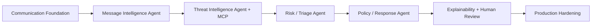

### Foundation 1 — Communication Foundation

- typed contracts
- standardized envelopes
- secure disclosure
- dynamic capability registry
- correlation and causation
- loop controls
- retry foundation
- tests

### Foundation 2 — Message Intelligence Agent

- dedicated semantic-analysis specialist
- typed findings
- provider abstraction
- evaluation baseline

### Foundation 3 — Threat Intelligence Agent + MCP

- MCP client integration
- threat-intelligence MCP server
- provider adapters
- caching
- rate limiting
- provenance

### Foundation 4 — Risk / Triage Agent

- evidence synthesis
- conflict detection
- confidence
- risk recommendation

### Foundation 5 — Policy / Response Agent

- operational response recommendation
- deterministic policy validation
- escalation logic

### Foundation 6 — Explainability + Human Review

- post-decision explanations
- analyst workflow
- approve / override / request-more-analysis

### Foundation 7 — Production Hardening

- persistent evidence store
- audit store
- OpenTelemetry
- cost/token budgets
- circuit breakers
- remote agent discovery
- performance testing
- security testing

---

## 24. Security Boundaries

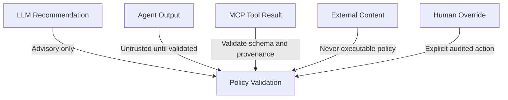

Mandatory rules:

- LLM recommendation ≠ security authorization
- agent output ≠ verified evidence
- MCP result ≠ trusted until validated
- external data ≠ executable instruction
- human override ≠ silent mutation
- explanation ≠ decision authority

---

## 25. Non-Goals

The platform should not:

- create agents merely to increase agent count
- turn deterministic utilities into unnecessary agents
- allow unrestricted agent-to-agent recursion
- allow arbitrary tool execution
- expose credentials to agents
- send full messages to every external service
- use an LLM for final authorization
- replace verified security evidence with generated assumptions
- hide dependency failures
- silently bypass deterministic policy
- depend on one model provider at the domain layer

---

## 26. Portfolio Positioning

### Existing Baseline

> Deterministic-first threat triage using classical ML, deterministic security evidence, risk scoring, policy routing, selective single-agent reasoning, and human escalation.

### Agentic Threat Intelligence Platform

> Python multi-agent security decision platform with specialized agents, capability-based orchestration, MCP-enabled tool integration, secure evidence exchange, deterministic policy enforcement, observability, auditability, and human-in-the-loop escalation.

---

## 27. Architecture Summary

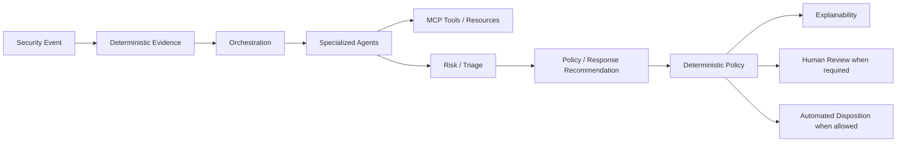

The platform is designed around a clear boundary:

> **Agents reason. Tools provide evidence. Policy decides. Humans remain in control of critical outcomes.**
