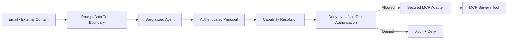

## Agent Identity, Tool Authorization and Prompt-Injection Boundary

The platform treats agent identity and tool execution as explicit deterministic security boundaries.

Key rules:

- an agent discovering a tool does not imply permission to execute it
- every tool call requires an authenticated principal
- scopes and tool-specific argument policy are deterministic
- destructive actions can require explicit human approval
- email bodies and external tool output are treated as untrusted data
- prompt-injection detection is telemetry, not the primary control
- authorization and final disposition remain outside LLM reasoning
- every tool authorization and execution can be audited

For AWS/GCP portability, the security principal is cloud-neutral and can be backed by AWS IAM, GCP workload identity, or OIDC without changing agent business logic.
