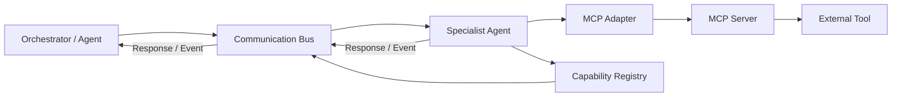
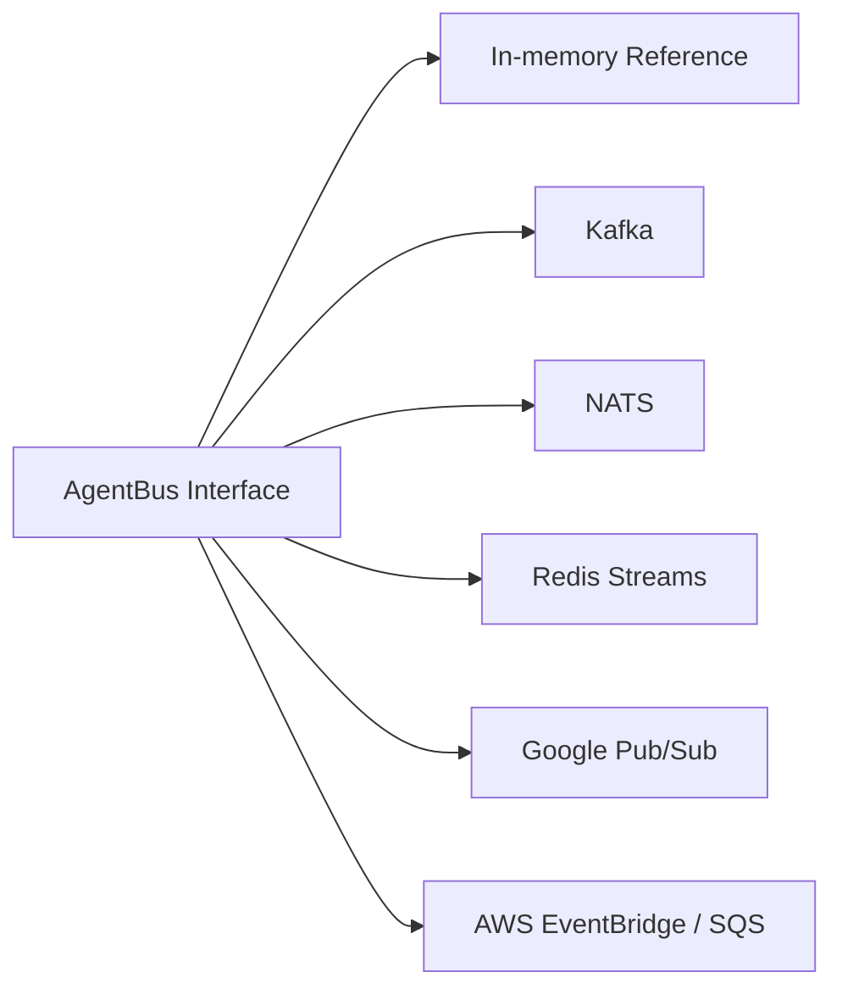

# Communication Framework

## Core flow

## Patterns

- Mediator — communication bus controls collaboration.
- Registry — dynamic capability discovery.
- Command — typed requests represent work.
- Observer / Pub-Sub — events and progress updates.
- Adapter — MCP and model-provider integration.
- Strategy — disclosure and routing policy.
- Circuit Breaker — remote dependency isolation.

## Transport evolution

