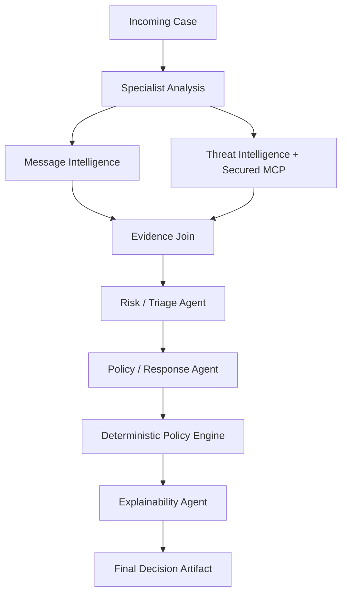
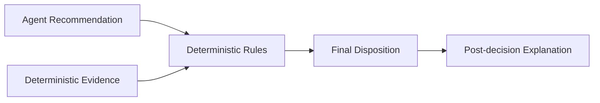

# Full Agentic Decision Pipeline

## Architecture

## Authority boundary

The agentic stages are advisory. `DeterministicPolicyEngine` is the final authority.

A model may increase scrutiny under explicit deterministic confidence thresholds, but it cannot downgrade deterministic controls. A high-confidence model recommendation to quarantine from a low/medium deterministic baseline is converted into `HUMAN_REVIEW`, not direct quarantine.

## Human review

`HUMAN_REVIEW` is now represented explicitly in the returned decision artifact. This phase deliberately does not pause/resume the graph with an in-memory checkpointer.

For the 100+ user cloud deployment, durable human approval should use a shared production checkpointer, preferably PostgreSQL-backed:

- AWS: Aurora/RDS PostgreSQL
- GCP: Cloud SQL PostgreSQL

That avoids process-local state and permits horizontal scaling.

## Explainability

Explainability runs only after the final deterministic decision. It cannot change the disposition and its `AgentResult.recommendation` is always `None`.
