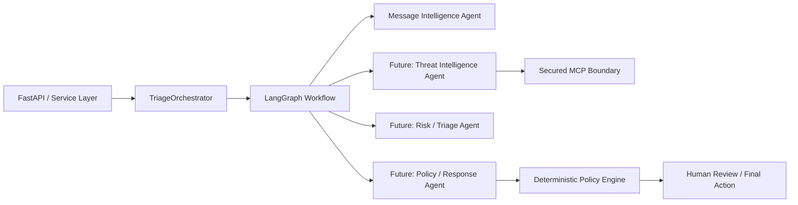
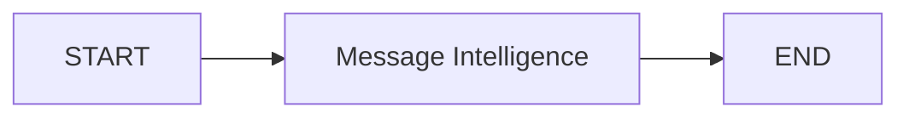
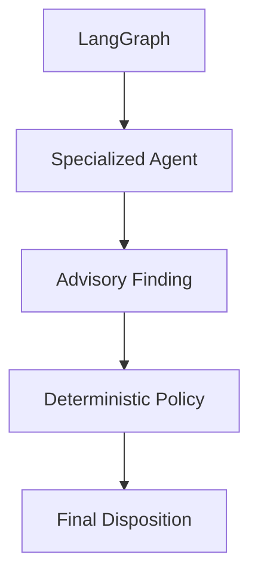

# LangGraph Orchestration

## Decision

The platform uses **LangGraph as the workflow engine inside the orchestration
layer**. LangGraph does not replace the platform's security boundaries,
communication contracts, MCP authorization, or deterministic policy engine.



## Foundation 2 graph

The first graph is intentionally small:



This validates the orchestration boundary before adding fan-out, conditional
routing, retries, cycles, or human interrupts.

## Why `TriageOrchestrator` remains a facade

Application code should call `TriageOrchestrator`, not LangGraph directly.
This preserves a stable application boundary and prevents framework details
from leaking into FastAPI, security, cloud, or dashboard code.

The pattern is:

```text
API
  -> TriageOrchestrator
      -> LangGraph workflow
          -> SpecializedAgent
```

## Concurrency and 100+ users

The compiled graph is created once and reused.

Each invocation supplies its own state. No mutable case state is held in a
module-level global or on the orchestrator. This makes the current workflow
appropriate for horizontal application scaling.

The Foundation 2 workflow intentionally does **not** configure an in-memory
LangGraph checkpointer.

For later durable workflows and human approval, use an external shared
checkpointer. A PostgreSQL-backed checkpointer is preferred for cloud
portability:

- AWS: Amazon RDS/Aurora PostgreSQL
- GCP: Cloud SQL for PostgreSQL

This avoids coupling workflow semantics to one cloud provider.

## Security boundary

LangGraph coordinates work. It is not the security authority.

The following remain outside or below the graph:

- workload/user identity
- disclosure policy
- MCP tool authorization
- secret handling
- PII/DLP controls
- final deterministic policy
- audit persistence



## Evolution

Future graph stages can add:

1. Message Intelligence
2. Threat Intelligence in parallel where applicable
3. evidence aggregation
4. Risk / Triage
5. conditional request for more evidence
6. Policy / Response recommendation
7. deterministic policy enforcement
8. human review interrupt
9. post-decision explainability

The graph may contain controlled cycles, but the existing hop, invocation,
deadline, cost, and authorization controls remain authoritative.
