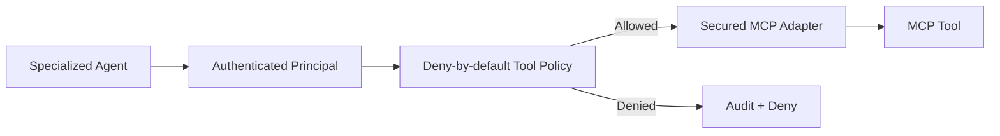
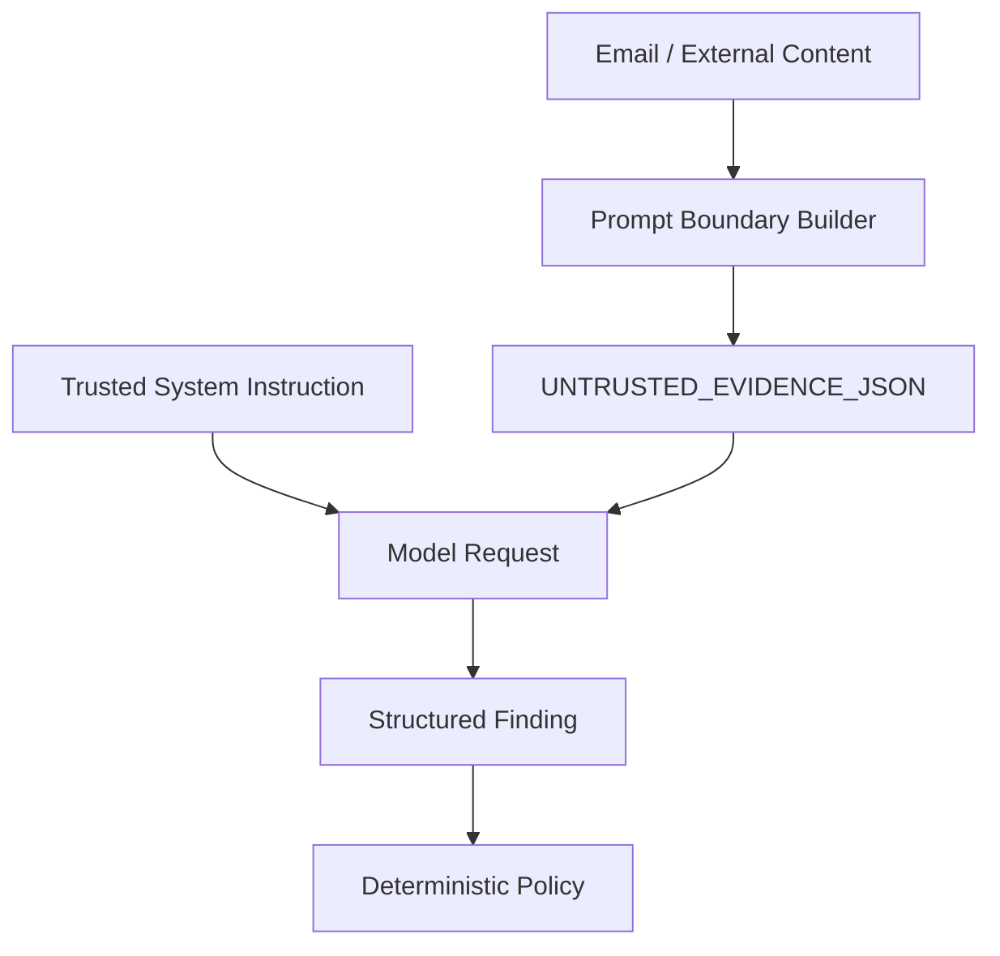

# Security Model

The platform uses explicit security boundaries rather than relying on agent behavior.

## Agent identity

Every production user, agent, and service has an authenticated principal.

The domain model is cloud-neutral:

- AWS can map principals to IAM roles/workload identities.
- GCP can map principals to service accounts/workload identities.
- Human users can map to OIDC identities and tenant membership.

## Tool authorization

MCP discovery does not imply MCP execution permission.

Every tool call must pass through deterministic authorization:

Policies can enforce:

- allowed agent/user identities
- required scopes
- allowed argument names
- tool risk classification
- human approval for destructive operations

## Prompt and data trust boundary

Email bodies, user text, URLs, attachments, and external tool output are treated as untrusted data.

Prompt-injection pattern detection is telemetry only. It is not the primary security control.

The primary controls are:

- trusted/untrusted instruction separation
- minimum-necessary disclosure
- deterministic tool authorization
- deterministic final policy
- explicit human approval for destructive actions

## Existing controls retained

- agent output is untrusted until schema/policy validation
- external MCP results are untrusted until validated
- credentials never appear in envelopes
- minimum-necessary allow-list disclosure is mandatory
- correlation/causation IDs preserve traceability
- hop and invocation budgets prevent uncontrolled loops

## Production hardening

Future cloud adapters should add:

- workload identity
- signed service-to-service tokens
- mTLS where required
- centralized immutable audit storage
- DLP / PII redaction
- tenant isolation
- secret-manager integration
- policy-as-code
- anomaly detection on agent/tool behavior
- emergency agent/tool revocation
