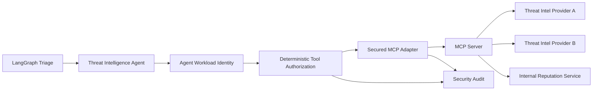
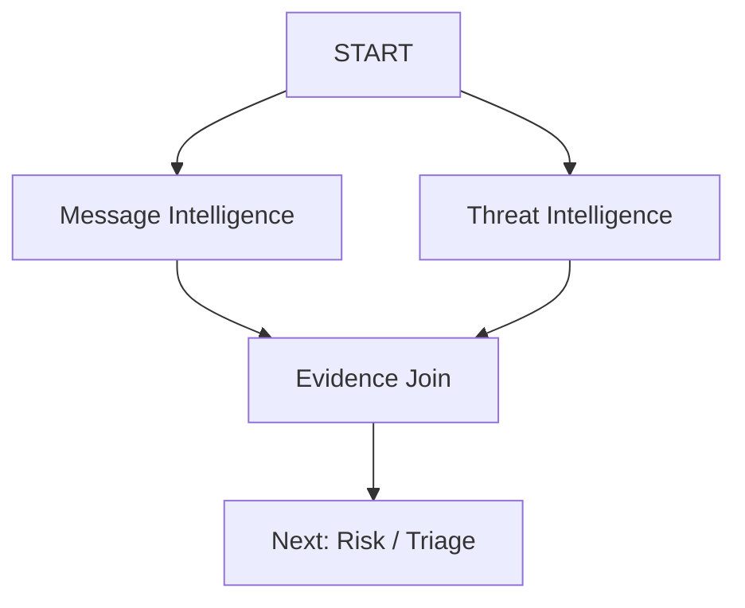
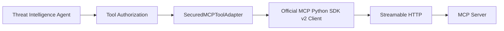

# Threat Intelligence Agent + Secured MCP

## Architecture



The agent never calls a provider SDK directly. All provider access crosses the
secured MCP boundary.

## Logical MCP tools

The domain layer uses provider-neutral logical tool names:

- `threat_intel.url.lookup`
- `threat_intel.domain.lookup`
- `threat_intel.ip.lookup`
- `threat_intel.hash.lookup`

The MCP server decides which provider or internal service implements each
logical tool.

This keeps the Agentic Threat Intelligence domain independent of VirusTotal,
URLHaus, AbuseIPDB, AWS, GCP, or any other provider.

## Identity and authorization

The Threat Intelligence Agent runs with a dedicated agent identity:

```text
agent:threat-intelligence
```

It requires:

```text
threat-intel:read
```

The default policy is deny-by-default and allows only read-only threat
intelligence lookup tools with indicator-specific arguments.

The LLM cannot grant itself additional permissions.

## External results are untrusted

MCP results are validated before they become `AgentFinding` evidence.

Required fields:

```json
{
  "verdict": "malicious | suspicious | benign | unknown",
  "confidence": 0.0,
  "provider": "provider-name"
}
```

Arbitrary provider text is not copied into the trusted finding summary.
The platform constructs the analyst summary from validated fields.

## LangGraph execution

Message Intelligence and Threat Intelligence are independent specialists and
fan out in parallel:



If there are no technical indicators, the Threat Intelligence branch performs
no MCP calls and returns no threat-intelligence result.

## Scale

No case data is stored in global mutable process state.

The graph can therefore run concurrently in multiple stateless API/worker
instances. For the 100+ user deployment target:

- GCP: Cloud Run/GKE workers + external MCP services
- AWS: ECS/Fargate/EKS workers + external MCP services
- provider credentials live in cloud secret managers
- production audit events go to centralized logging/audit storage
- provider-wide quotas should be enforced at the MCP service layer


## Official MCP transport

Production Streamable HTTP connectivity is implemented by:

`mcp/python_sdk_client.py`

It uses the official MCP Python SDK v2 `Client` API and consumes only
`structured_content` from `CallToolResult`.

Remote model-readable `content` blocks are not automatically promoted into
trusted evidence. Tool-level `is_error` results fail the application call, and
missing structured output is rejected.

The flow is therefore:


